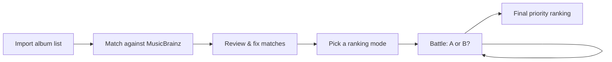

<div align="center">
  <h1>Solitude</h1>
  <p>Decide which vinyl records deserve your money first — one battle at a time.</p>

  <p>
    <a href="#demo">Demo</a> •
    <a href="#how-it-works">How It Works</a> •
    <a href="#ranking-modes">Ranking Modes</a> •
    <a href="#getting-started">Getting Started</a> •
    <a href="#your-data">Your Data</a> •
    <a href="#deployment">Deployment</a>
  </p>

  <p>
    
    
    
  </p>
</div>

<p align="center">
  
</p>

<p align="center">
  <sub>Paste a wishlist → settle uncertain matches → choose a listening depth → trust your instinct.</sub>
</p>

---

## Overview

Solitude is a browser-only React app for answering a deceptively hard question: **which record should you buy next?** Paste a wishlist, let Solitude enrich it with metadata and cover art from [MusicBrainz](https://musicbrainz.org), then choose between two records at a time. When the dust settles, you have a priority order built from your own instincts—not ratings, popularity, or an opaque recommendation model.

Everything runs client-side. There is no backend, no account, no analytics, and no database — your collections live entirely in your browser's `localStorage`.

## Demo

The animation above is captured from the application itself. The fictional sleeves keep the repository free of bundled commercial artwork; your own matched Cover Art Archive images appear when you use the app.

### Try it in a minute

Start a collection and paste something like:

```text
Kind of Blue - Miles Davis
Chet Baker Sings - Chet Baker
Ella and Louis - Ella Fitzgerald & Louis Armstrong
Blue Train - John Coltrane
Abbey Road - The Beatles
```

Solitude handles dash variants, tab-separated columns, `Album by Artist`, title-only lines, and reversed Artist/Album columns. Confident catalog matches fold away automatically; only ambiguous records ask for your attention.

## How It Works



1. **Import** — paste a plain-text list. Supported formats: `Album - Artist` (any dash variant), tab-separated columns, `Album by Artist`, or title-only lines. A global toggle swaps the Artist/Album column interpretation if your list is reversed.
2. **Review** — each album is matched against MusicBrainz release groups using punctuation- and typo-tolerant searches. Strong matches collapse into compact confirmed rows; only ambiguous candidates stay open for review. Artwork shows a skeleton while loading and an artist-inspired fallback when no cover exists. You can edit titles, rematch, remove albums, or paste a custom HTTPS cover URL.
3. **Battle** — choose an algorithm and start deciding. Every matchup forces a choice (no ties, no skips), with Undo, live progress, and a remaining-time estimate that learns from your actual pace.
4. **Rank** — get the final order, revisit it anytime from the collection's history, or restart with a different mode.

Collections hold 2–100 unique albums. Runs can be interrupted freely — reload the page and resume exactly where you left off.

## Ranking Modes

| Mode         | Battles                     | Best for                                                                                                                                             |
| ------------ | --------------------------- | ---------------------------------------------------------------------------------------------------------------------------------------------------- |
| **Quick**    | 3 seeded round-robin rounds | Big lists where you just need the top picks. Ranks by win %, tied-group performance, and opponent strength — fast, but approximate in the middle.    |
| **Balanced** | Up to merge-sort worst case | The recommended default. An interactive merge sort that produces a complete, confident order without exhausting you.                                 |
| **Thorough** | Exactly `n × (n − 1) / 2`   | Small lists you care deeply about. Every pair meets exactly once; ranking uses total wins with head-to-head and strength-of-opposition tie-breakers. |

Every run saves a deterministic random seed: initial order, matchup order, and left/right presentation are all rebuilt from the seed plus the decision log. Undo and Resume replay the exact same tournament instead of depending on a fragile serialized algorithm cursor.

The remaining-time estimate starts at four seconds per choice, then learns from the median of your latest valid choices made while the page was visible; pauses longer than 30 seconds are ignored.

> [!TIP]
> Above 40 albums, Thorough mode gets long fast — 50 albums means 1,225 battles. The app warns you and estimates the duration before you commit.

## Getting Started

Requires **Node 24+** and npm.

```bash
git clone https://github.com/koobzaar/Solitude.git
cd Solitude
npm install
npm run dev
```

### Scripts

| Command             | What it does                                                          |
| ------------------- | --------------------------------------------------------------------- |
| `npm run dev`       | Start the Vite dev server                                             |
| `npm run typecheck` | TypeScript type checking                                              |
| `npm run lint`      | Lint the codebase                                                     |
| `npm test`          | Run the Vitest suite (parsers, algorithms, storage, API layer, flows) |
| `npm run coverage`  | Run tests with coverage reporting                                     |
| `npm run build`     | Production build, written to `dist/`                                  |
| `npm run preview`   | Preview the production build locally                                  |

## Your Data

- **Storage**: everything is saved to `localStorage` under `solitude:data:v1` (collections, runs, history) and `solitude:catalog:v2` (cached metadata searches and cover availability, 30-day expiry).
- **Privacy**: no data ever leaves your browser except the metadata queries sent to MusicBrainz and cover requests to the Cover Art Archive.
- **Portability**: collections do not sync across devices and cannot be exported yet. Clearing site data erases everything.
- **Resilience**: malformed stored state is ignored safely, and storage-quota failures are surfaced in the interface instead of failing silently.

## Metadata & Attribution

Album metadata is provided by the [MusicBrainz](https://musicbrainz.org) community database, queried at ≤ 1 request/second per their [API guidelines](https://musicbrainz.org/doc/MusicBrainz_API). Searches are safely queued, common typo-tolerant matches usually need one request, and results are cached locally for 30 days. Cover images come from the [Cover Art Archive](https://coverartarchive.org), a joint project of the Internet Archive and MusicBrainz; cover checks run separately and use a designed artist-inspired fallback when the archive has none.

Custom covers must be remote HTTPS URLs — image uploads are intentionally excluded so browser storage never fills up with binary data. Solitude bundles no album artwork or artist photography of its own; covers appear only from your catalog matches or custom URLs.

## Deployment

The workflow in [`.github/workflows/pages.yml`](.github/workflows/pages.yml) deploys the static build to **GitHub Pages**:

- Pull requests run linting, type checking, tests, and a production build.
- Pushes to `main` (and manual workflow dispatches) additionally deploy the built artifact with GitHub's official Pages actions.
- Vite uses a relative asset base, so the same build works under `/Solitude/` and a future custom domain.

> [!IMPORTANT]
> One-time repository setting required before the first deployment: **Settings → Pages → Build and deployment → Source → GitHub Actions**. Without it, the deploy job has nowhere to publish.

## License

Personal, non-commercial project.
