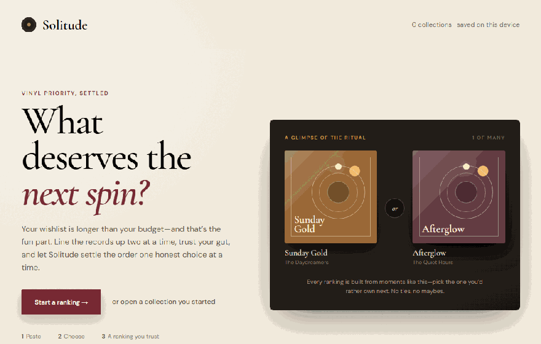
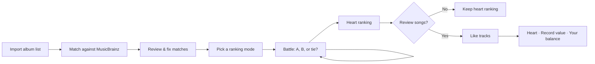

<div align="center">
  <h1>Solitude</h1>
  <p>Decide which vinyl records deserve your money first — one battle at a time.</p>

  <p>
    <a href="#demo">Demo</a> •
    <a href="#how-it-works">How It Works</a> •
    <a href="#ranking-modes">Ranking Modes</a> •
    <a href="#getting-started">Getting Started</a> •
    <a href="#your-data">Your Data</a> •
    <a href="#deployment">Deployment</a>
  </p>

  <p>
    
    
    
  </p>
</div>

<p align="center">
  
</p>

<p align="center">
  <sub>Paste a wishlist → settle uncertain matches → trust your instinct → optionally listen closer.</sub>
</p>

---

## Overview

Solitude is a browser-only React app for answering a deceptively hard question: **which record should you buy next?** Paste a wishlist, let Solitude enrich it with metadata and cover art from [MusicBrainz](https://musicbrainz.org), then choose between two records at a time. When the dust settles, you have a priority order built from your own instincts—not ratings, popularity, or an opaque recommendation model.

Everything runs client-side. There is no backend, no account, no analytics, and no database — your collections live entirely in your browser's `localStorage`.

## Demo

The animation above is captured from the application itself. The fictional sleeves keep the repository free of bundled commercial artwork; your own matched Cover Art Archive images appear when you use the app.

### Try it in a minute

Start a collection and paste something like:

```text
Kind of Blue - Miles Davis
Chet Baker Sings - Chet Baker
Ella and Louis - Ella Fitzgerald & Louis Armstrong
Blue Train - John Coltrane
Abbey Road - The Beatles
```

Solitude handles dash variants, tab-separated columns, `Album by Artist`, title-only lines, and reversed Artist/Album columns. Confident catalog matches fold away automatically; only ambiguous records ask for your attention.

## How It Works



1. **Import** — paste a plain-text list. Supported formats: `Album - Artist` (any dash variant), tab-separated columns, `Album by Artist`, or title-only lines. A global toggle swaps the Artist/Album column interpretation if your list is reversed.
2. **Review** — each album is matched against MusicBrainz release groups using punctuation- and typo-tolerant searches. Strong matches collapse into compact confirmed rows; only ambiguous candidates stay open for review. Artwork shows a skeleton while loading and an artist-inspired fallback when no cover exists. You can edit titles, rematch, remove albums, or paste a custom HTTPS cover URL.
3. **Battle** — choose a depth and start deciding. Pick either record or mark an honest tie; there are no skips. Undo, live progress, and a remaining-time estimate that learns from your actual pace remain available. Quick and Thorough use seeded schedules; Balanced adapts its next matchup to the evidence so far.
4. **Rank** — get the Bradley–Terry **Heart** order, revisit it anytime from the collection's history, or restart with a different mode.
5. **Review songs (optional)** — take one album at a time and select the heart beside each song you like. Songs are not compared or ranked against one another. You may skip unheard albums, use a likely standard MusicBrainz edition, choose another edition, or enter validated totals when no tracklist is available.
6. **Blend** — once at least one album has song evidence, switch between **Heart**, shrunk **Record value**, and **Your balance**. The live blend starts at 75% heart and 25% songs.

Collections hold 2–100 unique albums. Refreshing the same tab restores Import drafts, Review, mode selection, active battles, Results, and partial track review. A new tab deliberately opens at the library.

## Ranking Modes

| Mode         | Battles                     | Best for                                                                                                                                             |
| ------------ | --------------------------- | ---------------------------------------------------------------------------------------------------------------------------------------------------- |
| **Quick**    | 3 seeded round-robin rounds | Big lists where you just need the top picks. Fast and connected, but approximate in the middle.                                                      |
| **Balanced** | Exact adaptive budget       | The recommended default. Starts with a connected comparison chain, then favors uncertain and underexposed albums.                                   |
| **Thorough** | Exactly `n × (n − 1) / 2`   | Small lists you care deeply about. Every unique pair meets exactly once.                                                                              |

Every new run is marked `bt-v1` and saves a deterministic random seed. Initial order, schedule or adaptive tie-breaks, and left/right presentation are rebuilt from the seed plus the decision log. Undo and Resume therefore restore the exact matchup instead of depending on a fragile serialized algorithm cursor.

Balanced uses exactly:

```text
min(all unique pairs, old merge-sort ceiling + clamp(ceil(n / 5), 10, 20))
```

The first `n − 1` choices form a seeded chain, so every album is connected to the evidence graph. Later choices never repeat a pair.

The remaining-time estimate starts at four seconds per choice, then learns from the median of your latest valid choices made while the page was visible; pauses longer than 30 seconds are ignored.

> [!TIP]
> Above 40 albums, Thorough mode gets long fast — 50 albums means 1,225 battles. The app warns you and estimates the duration before you commit.

## How the math works

### Heart: Bradley–Terry

Solitude treats each album as having a hidden heart score `θ`. The chance that album `i` beats album `j` is the logistic probability `σ(θᵢ − θⱼ)`. It fits all choices together, rather than assuming your preferences must form a perfectly transitive sort. Wins contribute outcomes of `1` and `0`; ties contribute fractional outcomes of `0.5` to both albums. That means both an honest tie and a sincere cycle—A over B, B over C, C over A—are valid evidence, not corrupt data.

The fit uses L2 regularization with `λ = 1`. In plain language, limited evidence is gently pulled toward neutral instead of producing extreme claims from one win. Scores are centered at zero and fitted with deterministic coordinate-Newton iterations. This remains the standard Bradley–Terry model (`bt-v1`), with ties represented as fractional evidence rather than a separate tie parameter. Seeded order breaks genuine numerical ties.

Balanced estimates each unseen matchup's uncertainty with `p(1 − p)` and divides it by the square root of both albums' exposure. Close-to-50/50 pairs are informative; albums already heard many times receive less priority. This is adaptive uncertainty sampling, not a claim that the app knows what you should like.

### Record value: Likes and shrinkage

An untouched track contributes zero and each liked track contributes one success: `successes = liked`. The heart beside a track toggles that binary signal.

Sparse albums are stabilized with an eight-track Beta prior. First Solitude estimates the collection mean:

```text
μ = (sum of successes + 4) / (sum of tracks + 8)
```

Then each reviewed album receives:

```text
Tᵢ = (successesᵢ + 8μ) / (tracksᵢ + 8)
```

This shrinkage stops a two-track release with one favorite from automatically overpowering a long album backed by much more evidence. Skipped and unreviewed albums are shown separately in Record value.

### Your balance: standardized blend

Heart scores and Record value use different units, so each is converted to a z-score—distance from its mean in standard-deviation units—before blending:

```text
Cᵢ = w × z(θᵢ) + (1 − w) × z(Tᵢ)
```

The slider defaults to `w = 0.75`. Unreviewed albums receive a neutral song z-score of zero. The interface also calls out strong reversals where heart and song gaps point in opposite directions and both standardized gaps are at least `0.75`.

> [!NOTE]
> Heart and songs are not independent: you probably considered the music while choosing whole albums. The blend can therefore double-count some taste. Treat it as another lens, not a more objective truth.

## Getting Started

Requires **Node 24+** and npm.

```bash
git clone https://github.com/koobzaar/Solitude.git
cd Solitude
npm install
npm run dev
```

### Scripts

| Command             | What it does                                                          |
| ------------------- | --------------------------------------------------------------------- |
| `npm run dev`       | Start the Vite dev server                                             |
| `npm run typecheck` | TypeScript type checking                                              |
| `npm run lint`      | Lint the codebase                                                     |
| `npm test`          | Run the Vitest suite (parsers, algorithms, storage, API layer, flows) |
| `npm run coverage`  | Run tests with coverage reporting                                     |
| `npm run build`     | Production build, written to `dist/`                                  |
| `npm run preview`   | Preview the production build locally                                  |

## Your Data

- **Storage**: collections, `bt-v1` runs, reusable track profiles, and frozen result snapshots are saved to `localStorage` under `solitude:data:v3`. Search, cover-availability, edition, and tracklist metadata use catalog schema v3 under the stable `solitude:catalog:v2` key with a 30-day expiry.
- **Refresh restoration**: guarded tab-only navigation is stored in `sessionStorage` under `solitude:navigation:v1`. Corrupt or stale collection/run references return safely to the library with a notice.
- **Schema changes**: pre-launch data from earlier storage schemas is intentionally discarded instead of migrated.
- **Artwork cache**: remote Cover Art Archive and custom HTTPS image bytes use browser `CacheStorage`, never `localStorage`. An image-only service worker keeps them for seven days, limits the cache to 250 least-recently-used entries, refreshes expired art, and falls back to stale art if refresh fails. Unsupported or storage-restricted browsers continue with normal `` requests.
- **Privacy**: the app remains browser-only—there is no backend. No data ever leaves your browser except the metadata queries sent to MusicBrainz and cover requests to the Cover Art Archive.
- **Portability**: collections do not sync across devices and cannot be exported yet. Clearing site data erases everything.
- **Resilience**: malformed stored state is ignored safely, and storage-quota failures are surfaced in the interface instead of failing silently.

## Metadata & Attribution

Album metadata is provided by the [MusicBrainz](https://musicbrainz.org) community database, queried through one shared 1.1-second queue per their [API guidelines](https://musicbrainz.org/doc/MusicBrainz_API). Searches are safely queued, common typo-tolerant matches usually need one request, and results are cached locally for 30 days. Track review browses up to ten releases with recordings per request, selects a likely standard official edition deterministically, and only asks for more editions on demand. Cover images come from the [Cover Art Archive](https://coverartarchive.org), a joint project of the Internet Archive and MusicBrainz; cover checks run separately and use a designed artist-inspired fallback when the archive has none.

Custom covers must be remote HTTPS URLs — image uploads are intentionally excluded so browser storage never fills up with binary data. Solitude bundles no album artwork or artist photography of its own; covers appear only from your catalog matches or custom URLs.

## Deployment

The workflow in [`.github/workflows/pages.yml`](.github/workflows/pages.yml) deploys the static build to **GitHub Pages**:

- Pull requests run linting, type checking, tests, and a production build.
- Pushes to `main` (and manual workflow dispatches) additionally deploy the built artifact with GitHub's official Pages actions.
- Vite uses a relative asset base, so the same build works under `/Solitude/` and a future custom domain.

> [!IMPORTANT]
> One-time repository setting required before the first deployment: **Settings → Pages → Build and deployment → Source → GitHub Actions**. Without it, the deploy job has nowhere to publish.

## License

Personal, non-commercial project.
